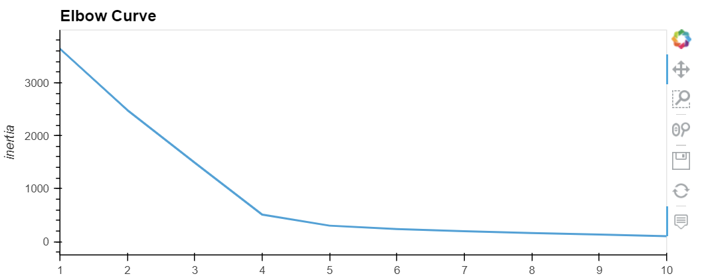
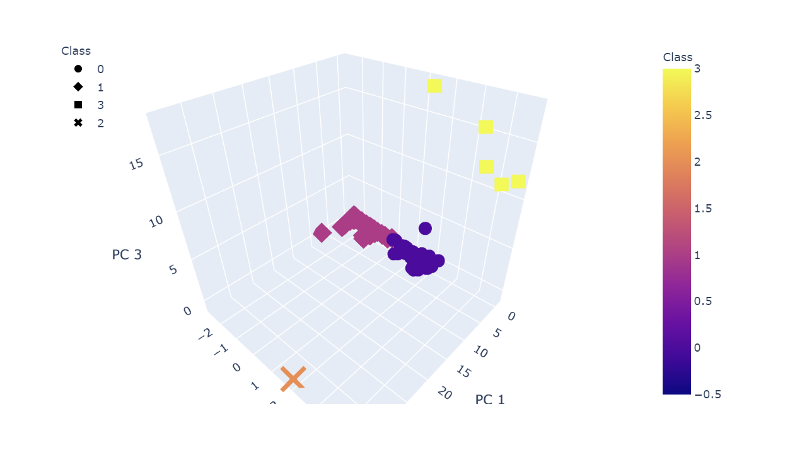
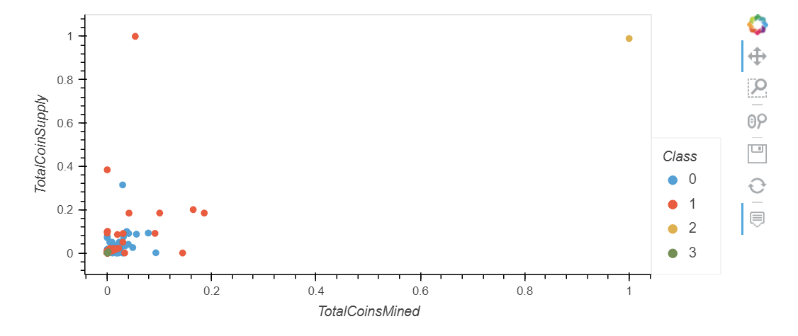

# Cryptocurrencies

## Purpose
In this project, I try to classify cryptocurrencies. Since there is no known output, I has decided to use unsupervised learning. I will:
- Preprocessing the Data for PCA
- Reducing Data Dimensions Using PCA
- Clustering Cryptocurrencies Using K-means
- Visualizing Cryptocurrencies Results

I will use data visualizations to share findings in the end.

## Preprocessing the Data
  - remove NA rows
  - removed useless columns
  - filter rows with some criteria
  - create dummy variables for columns, which have mutiple factor levels
  - standardizing columns
  
## PCA
 - Three components

## Clustering
  - Find the best K using elbow plots
  - Apply Kmeans with k=4

## Visualizing Cryptocurrencies Results
  - Use the MinMaxScaler().fit_transform method to scale the TotalCoinSupply and TotalCoinsMined columns between the given range of zero and one
  - Create 3D plot for pc1, pc2 and pc3
  - Create 2D plot(x="TotalCoinsMined", y="TotalCoinSupply")
  
  
  
  
  
  
  

